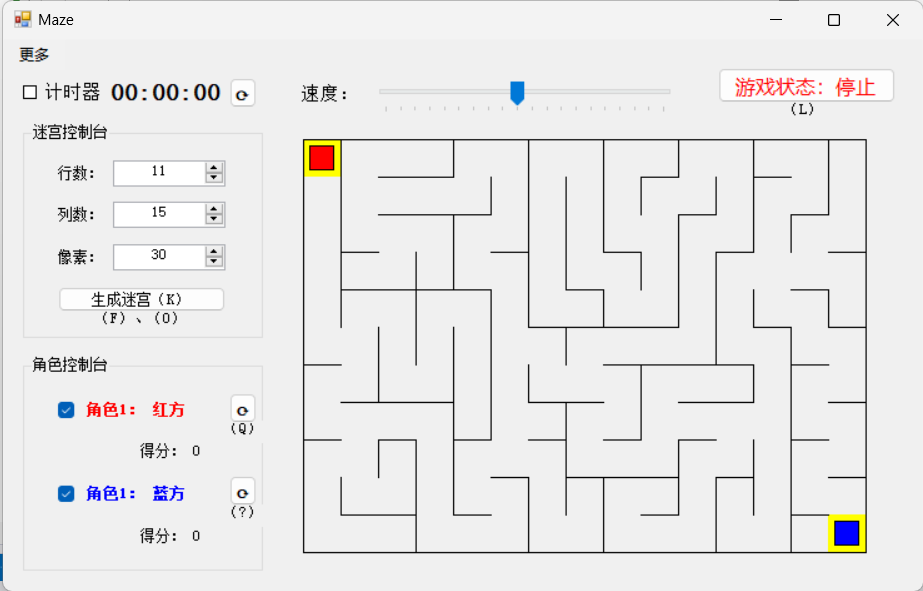

# Maze2
双人迷宫游戏 - 学校C#程序设计选修课大作业

# 快捷键用法

全局：
+ L改变游戏状态
+ K生成迷宫
+ 鼠标可强制移动方块

红方：
* 空格标记地点
* 1、3传送至标记处
* Q回到起点
* E撤销回到起点的操作
* F胜利时开启下一关

蓝方：
- .标记地点
- 1、3传送至标记处
- ?回到起点
- '撤销回到起点的操作
- 0胜利时开启下一关

# 项目设计
1. 系统可以根据玩家指定的规格生成迷宫；
2. 两名玩家可以操作各自的方向键实现各自方块的移动，但移动过程中不能穿墙；
3. 系统拥有计时器，可由玩家自由开启关闭；
4. 方块移速可由玩家调节；
5. 一名玩家到达另一名玩家的起点时，系统会自动为前者加分。此后该玩家可通过快捷键（红F蓝0）刷新地图，并使所有玩家回到起点，以避免对方得分（当然也可以不这么做，和谐友好，等待别人也成功）；
6. 方块在行进过程中玩家可以通过快捷键（红空格蓝.）标记地点，此后可以通过快捷键（蓝F1F3红13）传送至标记点（并且可以前后自由切换）；玩家也可以通过快捷键（蓝Q红？）快速回到起点，此操作可撤销（蓝E红“”）；
7. 作弊操作：可用鼠标拖动方块使其移动到迷宫内任意处；
8. 此外，系统还能记录玩家的所有成功数据，并展示得分板以查看；
9. 系统还具有其它功能及快捷键可能还未列举完全，具体内容详见成品。
